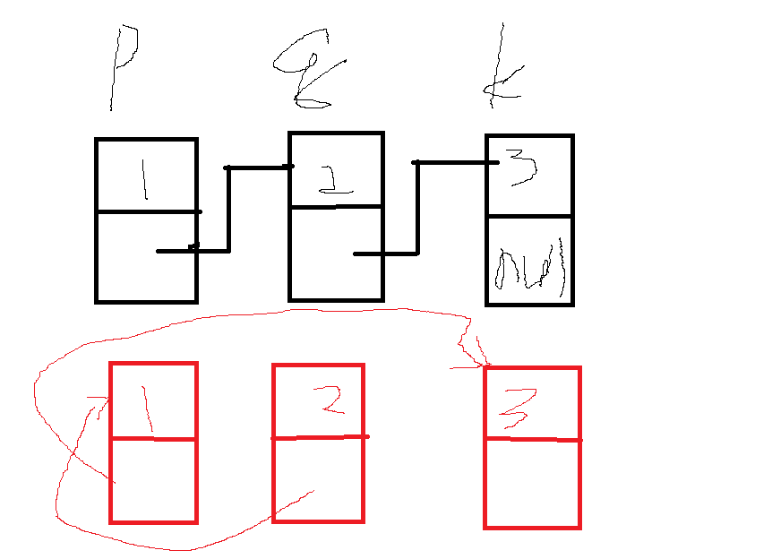

### Swap Nodes in Pairs

>Given a linked list, swap every two adjacent nodes and return its head.

> For example,
Given 1->2->3->4, you should return the list as 2->1->4->3.

> Your algorithm should use only constant space. You may not modify the values in the list, only nodes itself can be changed.

###### 就是相邻的两个交换

```
#include<iostream>
using namespace std;


struct ListNode {
    int val;
    ListNode *next;
    ListNode(int x) : val(x), next(NULL) {}
    
};
class Solution {
public:
    ListNode* swapPairs(ListNode* head) {
        ListNode *k, *p, *q, *y = NULL;
        bool flag = false;
        p = head;
        while (p!=NULL )
        {
            q = p->next;
            if (q == NULL)
                break;
            k = q->next;
            p->next = k;
            q->next = p;
            //head = q;
            if (flag){
                y->next = q;

            }
            y = p;

            p = p->next;
            if (!flag){
                head = q;
                flag = true;
            }
        }

        return head;
    }

    void display_list(ListNode* head){
        while (head != NULL)
        {
            cout << head->val << "  ";
            head = head->next;
        }
    }
};
int main() {
    int array[] = { 1, 2, 3};

    ListNode *head = new ListNode(array[0]);

    ListNode *p;
    p = head;

    for (int i = 1; i < 3; i++){
        ListNode* Node = new ListNode(array[i]);
        head->next = Node;
        head = Node;
    }

    Solution solution;
    solution.display_list(p);
    head = solution.swapPairs(p);
    cout << endl;
    solution.display_list(head);
}

```

* 这道题很简单，主要是处理链的后两个





* 如果q为空的话，那么就不用继续下去了，
* p->next 指向k，
* q->next 指向p
* 如果他是第一次的话，head 值就是q值
* y 是用来记录q的上一个节点的，